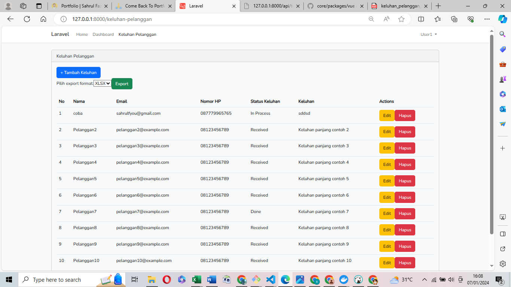

## tampilan view dashboard
untuk screenshoot tampilan dashboard ada di image

## tampilan view keluhan pelanggan
untuk screenshoot tampilan keluhana  pelanggan ada di image

## API
#### untuk update status 
http://127.0.0.1:8000/api/keluhan-pelanggan/{id}/update-status

#### delete status 
http://127.0.0.1:8000/api/keluhan-pelanggan/{id}/delete-status

## test CRUD
php artisan test

## migration 
php artisan migrate 

# seeder
php artisan db:seed
